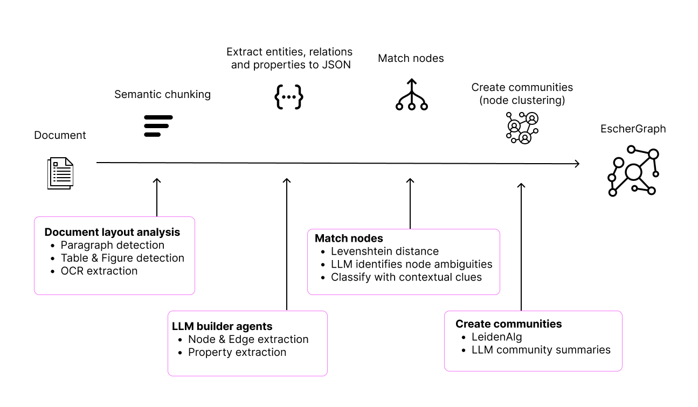

# EscherGraph
## Getting started

Let's learn how to build, and RAG search with **EscherGraph** in under 5 min.



### Installing
Install the package in your Python environment with the following command.

```bash
pip install eschergraph
```

To build and search with EscherGraph: an LLM, an embedding model, and a reranker are needed. We recommend using OpenAI's GPT4o and text-embedding-3-large models, and the jina-reranker-v2-base-multilingual from Jina AI. These are also the defaults.
In the upcoming examples, we will assume that these defaults are used.

In case you still need to obtain a Jina AI API key, you can get a key with 1 million tokens, free and without registration [here](https://jina.ai/).

### Credentials
The API keys needed to connect with external API's can be supplied to the graph in two ways:
1. via environment variables;
2. optional keyword arguments when instantiating the graph.

Below we will consider both ways in which a graph instance can be created. Note that it is also possible to supply the required credentials using a combination of these methods, as long as all the keys are supplied at least once.

### Initialize graph
#### 1. Environment variables
First, put your Jina AI and OpenAI API keys in a `.env` file.

```python
# .env file
OPENAI_API_KEY = ... 
JINA_API_KEY = ...
```

Then, when instantiating a graph, make sure to have the environment variables loaded.
For example, you can use the `load_dotenv` function from the library `python-dotenv` to load them
from a `.env` file.
```python
from dotenv import load_dotenv
from eschergraph import Graph

load_dotenv()

graph = Graph(name="pink_graph")
```

#### 2. Keyword arguments
```python
from eschergraph import Graph

graph = Graph(
  name="pink_graph",
  openai_api_key="...",
  jina_api_key="..."
)
```

Currently, the supported models are GPT4o and GPT4o-mini. We recommend always using GPT-4o for graph building, since GPT-4o mini introduces too much noise when building a graph. However, it is perfectly fine to use GPT-4o mini for playing around and testing. In case you wish to initialize a graph with GPT-4o mini, this is done in the following way.

```python
from eschergraph import Graph
from eschergraph.agents import OpenAIProvider
from eschergraph.agents import OpenAIModel

graph = Graph(
  name="pink_graph",
  model=OpenAIProvider(model=OpenAIModel.GPT_4o_MINI)
)
```

Now, that we have a graph instance, you will see that all basic operations are straightforward.

### Build graph
```python
my_file1 = 'test_files/Attention Is All You Need.pdf'

graph.build(files = my_file1)

# Adding more files to the graph is possible by simply building again:
my_file2 = "test_files/test_file2.txt"
my_file3 = "test_files/test_file3.pdf"

graph.build(files = [my_file2, my_file3])
```
Build can be used to add documents to the graph. All you need to do is specify the filepath of the files that you want to add to the graph. It is possible to specify both a string of a single filepath or a list containing multiple filepaths.

### Search
#### Local RAG search
A local RAG search uses the information stored in the graph to generate an answer using the most relevant information as extracted from the source.
```python
question = 'On which hardware chips were the inital models trained?'

answer = graph.search(question)
print(answer)
```
Local search considers all, nodes, edges, and properties to select the most relevant context using embedding similarity and reranking. 

#### Global RAG search
```python
global_question = 'What are the conclusions from the paper?'

answer = graph.global_search(question)
print(answer)
```
A global search considers the higher levels of the graph, and is great for answering general topic questions about the files in the graph.
For example, it can be used to draw conclusions and interpret a sentiment in a text.

### Visualize
#### Dashboard
```python
graph.dashboard()
```
Print general info and statistics about the graph using the dashboard.

#### Interactive plot
An interactive plot for the graph's lowest and community level can be generated easily as well.
```python
graph.visualize()
```

### Poppler disclaimer
As mentioned previously, our PDF parser uses Poppler internally to convert PDF into XML. Therefore, you are required to have Poppler installed when building a graph from PDF files with our package. Unfortunately, it can be quite a hassle to install Poppler on Windows. In order to mitigate this, our package will automatically install Poppler on Windows, if not already present. We do this by checking if the required functionality is in the path, if not, then we download a Poppler binary from [poppler-windows](https://github.com/oschwartz10612/poppler-windows). The zip file is then extracted and placed in the package's source. It is only during runtime that the binary is placed in the PATH and executed. Hence, this will only occur within the process that runs EscherGraph whilst parsing a PDF.

We wanted to be fully transparent about this, since a package downloading and running binaries on your hardware can also be done with malicious intent. However, we have done this to make it as easy as possible for Windows users to use our package. If interested, the corresponding code can be found in `eschergraph/tools/fast_pdf_parse/parser.py`.

### Contributors
- [@BjarneBepaData](https://github.com/BjarneBepaData)
- [@lennartbob](https://github.com/lennartbob)
- [@StevenJW](https://github.com/StevenJW)
- [@luckyluc99](https://github.com/luckyluc99)