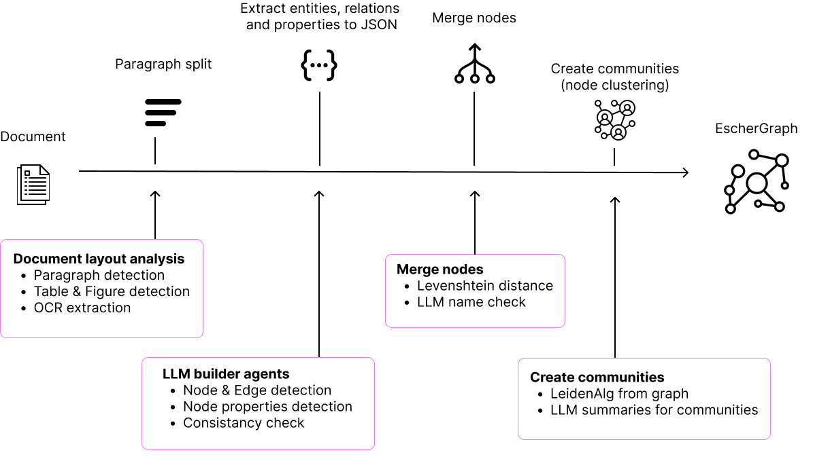

# Graph Building pipeline
### Eschergraph Pipeline

Some aspects of this graph building has been inspired by [GraphRAG](https://www.microsoft.com/en-us/research/blog/graphrag-unlocking-llm-discovery-on-narrative-private-data/) a Microsoft Research project. Especially the great work on graph community building, which allows for global questions is something we have implemented directly. 

The steps for the EscherGraph building are: 

1) Parse document into chunks around 500 tokens
2) Extracting nodes & edges using LLM for each chunk
3) Extracting properties using LLM for each chunk
4) Matching similair nodes and merging their edges and properties (more on this below)
5) Persist to graph repository
6) Building communities using the [LeidenAlg](https://github.com/vtraag/leidenalg)
7) Sync all nodes, edges and properties to a vector database -- on default [ChromaDB](https://www.trychroma.com/)

### Node Matcher

1. First, it identifies identical nodes using the Levenshtein distance.
   - Example of merging nodes include:
     - 'merging p100 to p100 gpu'
     - 'Sam' and 'Sam Altman'

2) Edge Cases: When dealing with nodes that have similar names but could refer to different entities (e.g., 'Sam', 'Sam Altman', and 'Sam Bankman-Fried'), the matcher uses additional context to differentiate between them. This involves:
     - LLM identifies node name ambigouities 
     - Classification with similarity: A re-ranker evaluates the similarity of the nodes based on context, metadata, or additional attributes to accurately determine which specific entity a node is pointing to. This helps in distinguishing between nodes like:

        - 'Sam' (could refer to Sam Altman or Sam Bankman-Fried)
        - 'Sam Altman'
        - 'Sam Bankman-Fried'
     - Contextual Clues: The re-ranker leverages contextual information from the surrounding data or relationships to clarify which node is the correct match. This might include looking at node connections, associated attributes, or other identifiers to make a more informed decision.